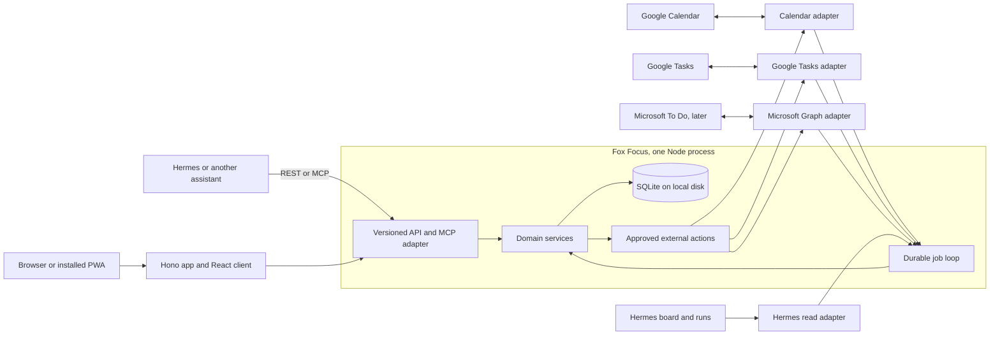
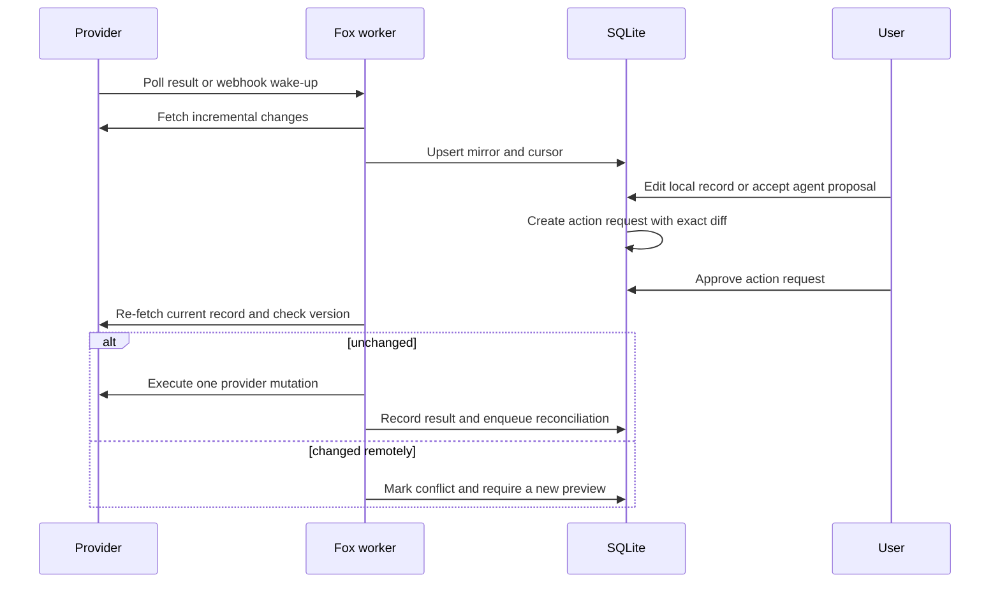

# Fox Focus architecture and delivery plan

Status: proposed, 10 September 2026.

This document describes the next product phases, not a list of features already shipped. The current prototype is a local React, Hono, and SQLite workspace with a read-only Hermes view. Google, Microsoft, MCP, durable jobs, provider OAuth, and notification delivery remain design work until they are implemented and tested.

This is the active plan for Fox Focus. It uses the existing project rules and the earlier Hermes handoff as input, but makes two deliberate changes:

- SQLite replaces PostgreSQL for the first deployment.
- Google Calendar and Google Tasks can become approved two-way integrations. They do not receive silent writes from Fox Focus or an agent.

## Recommendation

Build Fox Focus as one self-hosted TypeScript application with a local SQLite database, a static React client, a versioned REST API, and a thin MCP adapter over the same domain services.

Fox Focus should be the place where you see, triage, plan, and approve work. It should not try to become Hermes, Gmail, Google Calendar, or Microsoft To Do. Every task or calendar event has one declared home system. Fox Focus mirrors it, links it, and can request an approved change. It must not copy one task automatically into Google Tasks, Microsoft To Do, and a Hermes board, because that produces loops and loses fields that the providers do not share.

Use a dedicated `Fox Focus` Google Calendar and a dedicated `Fox Focus` Google Task list as the default writable targets. Existing calendars and task lists remain imported context until you explicitly opt them into write access. This gives the app a useful two-way path from the first release without treating shared appointments or the existing `personal-tasks` board as Fox Focus data.

## What the app owns

The existing `personal-tasks` board is the current gate on task ownership. My recommendation is to make Fox Focus the canonical home for personal action items only after a one-way shadow import, reconciliation, export, and explicit migration approval. Until that cutover, Fox Focus can hold captures, drafts, calendar blocks, local reminders, and a read-only task mirror, but it must not quietly create a second production commitment backlog.

| Record | Home system | Fox Focus role | Write rule |
| --- | --- | --- | --- |
| Area, reminder, inbox item, proposal, draft, plan, approval, activity record | Fox Focus | Canonical | Manual and scoped agent writes are allowed. |
| Personal task after an approved task migration | Fox Focus | Canonical | Manual writes are allowed. Agents submit proposals unless given an explicitly trusted local-write scope. |
| Fox Focus calendar block | Fox Focus with a linked Google Calendar event | Canonical local record plus Google representation | A Google write waits for a before-and-after preview and approval. |
| Google Calendar event created elsewhere | Google Calendar | Mirrored calendar context | Read by default. Clone it into a Fox Focus block instead of editing an invitation or shared event. |
| Google Task created elsewhere | Google Tasks | Mirrored task context | Read by default. Opt a list in only after its mapping has been tested. |
| Microsoft To Do task | Microsoft To Do | Later mirrored task context | Read by default, then approved write-through. |
| Hermes board/card/run | Hermes or its canonical board | Read-only operational context | Fox Focus shows selected information and links back. It does not mirror every card into a new board. |
| Gmail, Canvas, other source material | Original provider | Evidence and source links | Imported records stay source-owned. Agents create proposals that point at them. |

The `personal-tasks` board remains canonical until you explicitly approve a migration. Fox Focus may show a one-way mirror, but it must not create a competing task truth in the meantime.

## The product model

Calendar and tasks should share a timeline, not a database table with fake common semantics.

- A task has a state, priority, deadline, planned time, estimate, and optional reminders.
- A calendar event has a timed or all-day interval, attendee and recurrence semantics, and a source calendar.
- A task can have a scheduled calendar block. Scheduling a task creates or updates a linked event. It does not turn every due task into a meeting.
- A deadline is distinct from a task's planned time. An assignment may have a hard deadline and several planned focus blocks.
- An Inbox item is untriaged input, not another task state. When accepted, it becomes a task, event, draft, or a request for more work.

The Today view combines these records into one ordered picture:

1. Current and next calendar block.
2. A short list of tasks worth doing next.
3. Due-soon deadlines and planned work.
4. Inbox items and agent proposals that need a decision.
5. A compact Hermes status section when there is something active to see.

## Main user flows

### Add and schedule something yourself

1. Create a calendar block from the timetable. After the approved task cutover, create a local task from the global capture control too. Until then, capture a proposed task for the canonical board.
2. Choose an area such as University, Work, Personal, Health, or Admin. The area controls the Fox Focus colour.
3. If it needs a Google Calendar representation, Fox Focus creates an action request that shows the exact event it will add or change, including guest-notification behaviour.
4. Approve it. The worker writes it once, reads it back, and the normal importer confirms the final state.

For a local-only item, no approval is needed. For an external write, approval is mandatory even when the edit originated in the browser rather than an agent.

### Review agent-found work

1. An agent submits an Inbox item with a concise title, why it matters, source links, suggested due or planned time, and an idempotency key.
2. It appears in `/inbox` as `new`, with the agent name and evidence. It is not silently added to the task list or calendar.
3. You can accept it as a task, schedule a block, ask for a draft, ask for more work, defer it, or dismiss it.
4. Asking for more work creates an agent feedback record. Any compatible assistant can fetch it through MCP or REST and submit a revised proposal or draft.
5. The accepted result keeps links to the original Inbox item and evidence, so its origin is never lost.

### Keep Google Calendar current

1. The Calendar adapter performs an initial sync for each enabled calendar and persists a sync token per collection.
2. It later fetches incremental changes, including cancellations. A `410 Gone` discards the token and runs a full resync.
3. Polling is the first delivery mechanism. A later webhook only wakes the same sync worker because Google Calendar notifications contain no changed event body and can be dropped.
4. A user drag or edit creates a pending external action. The worker refetches the event and checks its ETag before writing. A changed event goes back to review instead of overwriting a newer remote edit.

### Keep tasks current without a sync loop

Each task has one home: `fox_focus`, `google_tasks`, `microsoft_todo`, or a future approved bridge. A Fox Focus task may have a Google Tasks representation, but it is never automatically copied into Microsoft To Do too.

When fields cannot survive a provider round trip, Fox Focus keeps them local and marks them clearly. Google Tasks does not represent priority, colour, timed deadlines, task reminders, or a general recurrence model through its API. Microsoft To Do has richer task fields, but it is still a separate mapping rather than a universal task schema.

## System shape



There is one application replica and one SQLite file. The same process serves the static application, REST API, webhook routes, MCP endpoint, and durable job loop. This is intentional. One user does not need a queue service, a Redis instance, a database server, and several deployable services to create a calendar block.

The job loop does run outside HTTP request handling. It claims rows from a `jobs` table, performs a bounded sync or delivery, and records the result. It handles polling, webhook-triggered sync, reminders, retries, outbox execution, and subscription renewal.

## Technology choices

| Layer | Use | Reason |
| --- | --- | --- |
| Runtime and package manager | Current Node LTS, TypeScript, pnpm | Familiar, simple to deploy, and a good fit for OAuth and MCP libraries. |
| Web application | React 19, Vite, React Router data routes, Hono on Node | Fox Focus is a private application, not a content site. Static assets plus a typed API are simpler than server-rendering machinery. |
| API contract | Hono, Zod 4, `@hono/zod-openapi`, OpenAPI | One runtime schema validates browser, agent, and provider-facing input and produces a human-readable API contract. |
| Calendar UI | FullCalendar Standard for React | The free MIT parts have day, week, month, list, select, drag, and resize. Its revert callback suits approval-backed changes. Do not let its event object become the domain model. |
| Database | SQLite, `better-sqlite3`, Drizzle migrations | A single user and one replica do not need PostgreSQL. Migrations stay checked in and queries stay local. |
| Time handling | `temporal-polyfill` and explicit IANA time zones | `Temporal` distinguishes an instant from a date-only value, which prevents the usual DST and midnight bugs. |
| Search | SQLite FTS5 | Search titles, notes, Inbox summaries, and approved source snippets without operating another service or sending private data to a vector database. |
| PWA and push | `vite-plugin-pwa` with `injectManifest`, then `web-push` | An installed app can cache its shell and receive a server-scheduled notification. Live task and calendar API responses remain network-only. |
| Agent interoperability | Official TypeScript MCP SDK over domain services | MCP stays a small adapter. REST/OpenAPI remains the stable contract for Hermes, scripts, and future assistants. |
| Tests | Vitest, Playwright | Vitest covers domain and sync behaviour. Playwright covers calendar drag/resize, Inbox review, and the installed-app flow. |
| Deployment | One Docker image, one named local-disk volume, Tailscale Serve or existing private HTTPS proxy | Private access first. Do not expose the database or app port directly. |

Hono and Astro are not really substitutes. Astro is excellent for a content site with occasional interactive islands. Fox Focus is a dense interactive application with an editable calendar, background jobs, OAuth callbacks, provider webhooks, a REST API, and MCP. Use Hono for that server surface and Vite/React for the client. A future public documentation or landing page could use Astro separately, but adding it to the private app would not simplify anything.

### Technologies to adopt later, not now

- Google Calendar watch channels and Microsoft Graph webhooks. Both need a public HTTPS callback and still require reconciliation polling or delta sync.
- An `ntfy` or similar notification adapter if Web Push proves too unreliable for important reminders.
- A Microsoft To Do adapter after Google Calendar and Google Tasks have proved the local model.
- A full-text source index for deliberate Gmail and Canvas summaries. Do not store raw mail bodies by default.

### Technologies to reject for this phase

- PostgreSQL, Redis, a separate queue, event sourcing, GraphQL, and a vector database. They add operational work without solving the first user's problem.
- LibSQL/Turso and distributed SQLite. The app has no multi-host database need.
- Schedule-X. Its central drag, resize, and drag-to-create interactions are paid plugins, while FullCalendar Standard supplies the features Fox Focus needs.
- A Hermes-specific core or direct database access for agents. That would make a future assistant swap much harder.

## SQLite operating rules

SQLite is the recommended database, with four conditions:

```sql
PRAGMA journal_mode = WAL;
PRAGMA foreign_keys = ON;
PRAGMA busy_timeout = 5000;
PRAGMA synchronous = FULL;
```

- Keep the live database, WAL file, and shared-memory file on the Docker host's local filesystem. Do not put them on NFS, SMB, or a NAS mount.
- Run one app replica. WAL permits concurrent readers and one writer, which is ample for a browser, a scheduler, and occasional sync work.
- Keep write transactions short and indexed. The job loop must not hold a transaction open while it calls Google or Microsoft.
- Back up through SQLite's online backup API or `VACUUM INTO`, not by copying only the main database file while WAL is active. Check the backup with `PRAGMA quick_check` before sending it to the existing backup system.
- Store OAuth refresh tokens outside SQLite. The database contains connection metadata and a secret reference, never the secret itself.

Move to PostgreSQL only if one of these becomes real: multiple live application replicas, more than one active user with sustained writes, a requirement to run worker and database on separate hosts, or a proven SQLite write-contention problem. Do not migrate based on a vague fear that SQLite is small.

## Repository layout

Start as one package, not a monorepo. Split it only when the MCP server or worker needs a genuinely separate release cycle.

```text
fox-focus/
├── src/
│   ├── client/                 # React routes, components, PWA UI
│   ├── server/
│   │   ├── api/                # Hono routes and OpenAPI registration
│   │   ├── db/                 # Drizzle schema, migrations, repositories
│   │   ├── domain/             # Task, calendar, inbox, approval services
│   │   ├── integrations/       # Google, Microsoft, Hermes adapters
│   │   ├── jobs/               # Durable scheduler, sync and reminder jobs
│   │   └── mcp/                # Streamable HTTP and optional stdio adapters
│   └── shared/                 # Zod contracts and neutral types
├── docs/
│   ├── architecture-plan.md
│   ├── data-ownership.md
│   ├── agent-contract.md
│   ├── provider-mappings.md
│   └── runbook.md
├── tests/
├── Dockerfile
├── compose.yaml
└── .env.example
```

The UI, REST routes, MCP tools, jobs, and provider adapters call domain services. They do not call each other over HTTP and they do not issue ad hoc SQL. That single rule keeps an agent tool from gaining behaviour that the browser cannot audit.

## Data model

These are the first tables. Provider-specific fields may grow, but they should not leak into every local task query.

| Table | Important fields | Purpose |
| --- | --- | --- |
| `connections` | `provider`, `account_label`, `secret_ref`, `scopes`, `status`, `last_success_at` | One OAuth or bridge connection without a stored secret. |
| `source_containers` | `connection_id`, `kind`, `external_id`, `name`, `access_role`, `colour` | Google calendars, task lists, Microsoft lists, and selected Hermes boards. |
| `areas` | `name`, `colour`, `sort_order` | User-owned aspects of life such as University and Personal. |
| `tasks` | `title`, `notes`, `state`, `priority`, `deadline_at`, `deadline_date`, `planned_start_at`, `estimate_minutes`, `area_id`, `home` | Local task model. `home` says which system owns its editable copy. |
| `calendar_events` | `title`, `starts_at`, `ends_at`, `all_day_start_date`, `all_day_end_date`, `source_timezone`, `area_id`, `status` | Timed and all-day calendar records. |
| `task_event_links` | `task_id`, `event_id`, `relation` | Connects a task with a scheduled focus block or related appointment. |
| `inbox_items` | `actor_id`, `title`, `summary`, `status`, `suggested_kind`, `source_url`, `idempotency_key` | Manual captures and agent-found work awaiting review. |
| `artifacts` | `inbox_item_id`, `kind`, `content`, `status`, `revision` | Drafts, research summaries, and a revised proposal. |
| `agent_feedback` | `inbox_item_id`, `actor_id`, `request`, `status`, `response_artifact_id` | "Bring me a draft" and "do more work" handoffs. |
| `external_links` | `entity_type`, `entity_id`, `provider`, `container_id`, `external_id`, `etag`, `source_updated_at`, `tombstoned_at`, `field_capabilities` | Stable provider identity, sync revision, provenance, and mapping limits. |
| `sync_cursors` | `connection_id`, `container_id`, `cursor_kind`, `cursor_value`, `last_full_sync_at` | Calendar sync tokens, Microsoft delta links, and Google Tasks poll watermarks. |
| `action_requests` | `provider`, `operation`, `before_json`, `after_json`, `expected_version`, `notification_effect`, `status`, `approved_at`, `expires_at` | The mandatory human-readable approval record for any external change. |
| `sync_conflicts` | `action_request_id`, `remote_snapshot`, `local_snapshot`, `reason`, `status` | A visible manual resolution path instead of hidden last-write-wins. |
| `jobs` | `kind`, `payload`, `run_after`, `lease_until`, `attempts`, `dedupe_key` | Durable work queue for a single process. |
| `reminders` | `entity_type`, `entity_id`, `remind_at`, `channel`, `dedupe_key`, `status` | A local reminder schedule. |
| `reminder_deliveries` | `reminder_id`, `device_id`, `attempt`, `outcome`, `delivered_at` | Deduplicated delivery intent and best-effort delivery history. |
| `activity_log` | `actor`, `action`, `entity`, `before_summary`, `after_summary`, `occurred_at` | Audit history without secrets or raw source bodies. |
| `api_clients` | `label`, `token_hash`, `scopes`, `last_used_at`, `revoked_at` | Individually revocable agent and script credentials. |

### Time and date rules

- Store exact instants as UTC integer epoch milliseconds.
- Store date-only values as `YYYY-MM-DD`, never as midnight UTC.
- Store an IANA time-zone ID next to recurring or provider-timed values. The display default is `Europe/Dublin`.
- Preserve all-day calendar ends as exclusive dates.
- Keep `deadline_at`, `deadline_date`, `planned_start_at`, and calendar start/end separate.
- Keep provider recurrence text and exceptions with the provider record. Do not invent a false universal recurrence format.
- Test Dublin's spring-forward and autumn-back dates, all-day events crossing midnight, and an event whose source time zone is not Dublin.

Google Tasks needs special care. Its `due` value is date-only even though the API serializes it as RFC 3339. It is a day to do or display the task, not a timed deadline. Fox Focus must not silently turn it into `00:00 UTC`.

### Provenance and privacy rules

- Every imported record keeps provider, account, container, external ID, source URL, source update time, and a payload hash.
- Store only normalized provider fields needed for the feature. Do not retain raw Gmail message bodies or unbounded provider payloads in SQLite.
- Source content is data, not agent instruction. An email or calendar description cannot authorize an external action.
- Local annotations, plans, and reminders link to imported data instead of mutating it in place.
- Activity records show a useful summary of the change but never secrets, OAuth headers, or full private email text.

## Colour, lists, priority, and sorting

Fox Focus owns the visual system:

- Areas use a stable local colour token and can be applied to tasks and Fox Focus calendar blocks.
- Imported Google Calendar events preserve the provider's colour or event label. Fox Focus does not overwrite a remote colour unless the approved change explicitly includes it.
- The user can map an area to an enabled Google Calendar colour or event label. The mapping is per calendar because palettes and event labels are provider-specific.
- Task lists provide a source-oriented grouping. Fox Focus also has views by area, priority, deadline, and planned time.
- Local priority uses `urgent`, `high`, `medium`, `low`, and `none`. It is editable in the app.

Provider fidelity is intentionally visible:

| Field | Google Calendar | Google Tasks | Microsoft To Do |
| --- | --- | --- | --- |
| Timed schedule | Yes | No | Yes |
| Date-only due value | Event dates, not task deadlines | Yes | Yes |
| Task priority | No | No | `low`, `normal`, `high` |
| Task reminder | Event reminder only | No | Yes |
| Event/task colour | Event label or colour | No | Named categories, with optional provider colour lookup |
| Ordering | Calendar time | Parent and position | List/order semantics |
| Recurrence | Rich RFC 5545 model | Not a general API field | Patterned recurrence |

Google Tasks can round-trip title, notes, completion, list, parent, position, and date-only due values. It cannot faithfully round-trip Fox Focus priority, colours, a timed deadline, or local reminders. Keep those local and show a `not synced to Google Tasks` note at edit time. Do not conceal data loss behind a generic sync badge.

## Provider connections and sync design

### OAuth and secret boundary

Use delegated OAuth 2.0 authorization-code flow with PKCE for Google and Microsoft. Request the smallest scope that enables the selected capability, and request offline access only for the local background process that needs a refresh token.

| Provider | First connection | Later write scope | Sync method |
| --- | --- | --- | --- |
| Google Calendar | Calendar-list discovery and read access to chosen calendars | `calendar.events.owned` for user-owned calendars. Broader event scope only after selecting a shared writable calendar. | Sync token per enabled calendar, scheduled reconciliation, optional watch channel. |
| Google Tasks | `tasks.readonly` for an import-only trial | `tasks` for the selected writable list | Poll `updatedMin` with a safety overlap and periodic full reconciliation. There is no documented Tasks sync token or push channel. |
| Microsoft To Do | Delegated `Tasks.ReadWrite` only when this phase starts | Same, with `offline_access` | Delta link per list, scheduled reconciliation, optional short-lived change subscription. |
| Hermes | A scoped Fox Focus client token plus Hermes's own documented read API or MCP contract | No provider credential sharing | Poll or receive its selected status feed. |

The browser should complete OAuth. The application stores a secret reference in `connections`; the actual token belongs in the existing local credential boundary or an encrypted secret file mounted read-only where possible. No token appears in the database, API response, audit log, sample environment file, or repository.

Before relying on a long-lived Google connection, verify the OAuth consent-screen publishing state. Google projects left in external testing can issue refresh tokens that expire after seven days for these scopes. This needs a narrow real-account probe during implementation, not an assumption in a document.

### General sync rule

Inbound provider changes are automatic. Outbound provider changes are approved write-through.



An action request records provider, account, target container, external ID, expected revision, exact before and after values, recurrence scope, whether guests may be notified, actor, reason, approval time, and expiry. Approval never unlocks a stale request. The worker refreshes the external record immediately before it writes.

### Google Calendar

Start with an explicit `Fox Focus` Google Calendar. It is the writable home for new blocks. Import selected existing calendars for context. Allow direct editing later only for an explicitly enabled calendar where you own the event.

- Initial sync obtains and persists a `nextSyncToken` per calendar. Incremental sync includes deletions. A `410` starts a clean full sync.
- Use normal polling at first. If faster updates matter, a public HTTPS webhook route can enqueue the same incremental job. Google watch channels need one channel per calendar, expire, contain no record body, and can miss messages.
- Keep invitation events, events organized by someone else, and recurring-series edits read-only at first. Offer `Create a Fox Focus block from this` instead.
- Show calendar event colour, source calendar, organiser, recurrence, and source link. Preserve the remote event's time zone for correct recurrence and DST handling.
- On an approved create, use a stable client-generated provider ID where the API permits it. On update, use the fetched ETag and conditional write. On failure, do not retry a create blindly.
- Show the exact `sendUpdates` choice in the approval screen. Calendar changes may email guests or propagate to attendees.

### Google Tasks

Google Tasks is a useful first task integration, but it is the least expressive of the supported task systems.

- Create one selected `Fox Focus` list for locally owned tasks. Other lists initially appear as read-only source context.
- Fetch task lists and their tasks on a bounded schedule. Store a safety-overlapped `updatedMin` watermark, include deletion and completion state needed for reconciliation, and run a periodic full scan.
- Use the provider `position`, parent, and task-list fields when a user intentionally sorts or moves a Google-owned task. Do not try to map local priority into the title or notes.
- Treat Docs and Chat assigned tasks as read-only if imported. Deleting them through the Tasks API can affect their original assignment source.
- Show date-only Google due values as `Do on`, not `deadline at`. A Fox Focus timed deadline or reminder remains local.

### Microsoft To Do

Microsoft To Do is a later adapter, not a prerequisite for the first daily-use build. Its richer task model makes it worth adding after the neutral task layer is proven.

- Persist its opaque delta link per list, following every next link before storing the final delta link.
- Use a webhook only as a wake-up. Renew it before expiry and keep scheduled delta reconciliation because subscriptions can fail.
- Map due/start date-times, reminder, recurrence, importance, task status, and linked resources explicitly.
- Do not assume Microsoft task IDs survive a list move. A move may look like a deletion plus a creation, so preserve linked-resource and provider metadata for reconciliation.
- Start with named categories rather than requesting an extra Mailbox Settings scope solely to render Outlook category colours.

### Conflict rules

1. A remote change that does not overlap an approved local field can be merged and displayed.
2. An overlapping remote change invalidates the local preview. Fox Focus shows the old value, the new remote value, and the desired local value.
3. The user chooses `keep provider version`, `make a new Fox Focus change`, or `merge manually`.
4. No agent can resolve an external conflict by itself.

Do not advertise an automatic "two-way merge". It would be misleading for provider fields that do not match, recurring events, invitations, and task moves.

## Inbox, drafts, and agent handoff

Inbox states are:

```text
new -> reviewing -> accepted | needs_more_work | draft_requested | deferred | dismissed
needs_more_work -> revised -> reviewing
draft_requested -> draft_ready -> reviewing
```

Each Inbox item needs these fields:

- What the agent found and why it believes it matters.
- A source URL or stable reference, not a copied private source body unless you deliberately captured it.
- The proposed action, deadline, area, priority, and confidence when present.
- Evidence links and agent identity.
- A stable idempotency key so a retry cannot create duplicate work.

The Inbox screen supports:

- Accept as a local task, with optional priority, deadline, and area.
- Schedule as a new Fox Focus calendar block.
- Ask for a draft and open its result beside the source link.
- Ask for more research, clarification, or a revised proposal.
- Link it to an existing task instead of duplicating one.
- Defer or dismiss it, while retaining an audit record.

Any assistant can participate because it sees the same neutral contract. Hermes merely receives a named client identity like `hermes-planning`, not a privileged place in the schema.

## REST and MCP contract

REST is the primary integration contract. MCP exposes the useful pieces of that contract to tool-using assistants. Both call the same services and preserve the same activity trail.

### Private machine-readable discovery

Expose these only on the private application origin:

```text
GET  /openapi.json
GET  /.well-known/api-catalog
GET  /docs/api
POST /mcp
GET  /mcp
```

Do not publish `llms.txt`, a public OpenAPI file, or a public MCP endpoint for a private life-management system. A configured user-delegated agent can discover the private API catalog and docs after it reaches the trusted origin.

### REST endpoints to build first

```text
GET    /api/v1/today
GET    /api/v1/timeline?from=&to=&area=&source=
GET    /api/v1/tasks?state=&area=&due_before=
POST   /api/v1/tasks
PATCH  /api/v1/tasks/:id
POST   /api/v1/tasks/:id/complete
GET    /api/v1/inbox?status=
POST   /api/v1/inbox
POST   /api/v1/inbox/:id/feedback
POST   /api/v1/inbox/:id/promote
GET    /api/v1/action-requests/:id
POST   /api/v1/action-requests/:id/approve
POST   /api/v1/action-requests/:id/reject
GET    /api/v1/integrations
POST   /api/v1/integrations/:id/sync
```

Every agent or script write supplies an idempotency key. List endpoints use cursor pagination where a list can grow. Unified responses include `origin`, source link, provider mapping state, and freshness information.

### MCP tools to build first

```text
fox_get_today()
fox_list_timeline(from, to, filters?)
fox_search_tasks(query, filters?)
fox_get_inbox_item(id)
fox_capture(text, source_url?, idempotency_key)
fox_submit_inbox_item(input, idempotency_key)
fox_submit_artifact(inbox_item_id, draft_or_research, idempotency_key)
fox_list_agent_feedback(actor_id)
fox_propose_external_change(input, idempotency_key)
fox_get_change_request(id)
```

There is no `execute_external_change`, `send_email`, `delete_event`, `edit_calendar_event`, or `submit_canvas` MCP tool. The proposal tool creates an action request only. A human reviews it in the browser.

Run Streamable HTTP MCP at `/mcp` for remote trusted agents and add a tiny stdio launcher only when a local client needs it. Current MCP transport guidance requires Origin validation and authentication for Streamable HTTP. Keep this code in one adapter module because MCP transport details will continue to change.

### Access boundary

Authentication can stay small, but it cannot be absent where agents can change your life data.

- The web application can start private on Tailscale or an equivalent trusted network, with a simple single-user session added before any public exposure.
- Every agent and script gets a distinct bearer token stored only as a hash, with scopes such as `focus:read`, `focus:inbox:write`, and `focus:proposal:write`.
- No agent gets a scope that skips external-action approval.
- Bind the app to the private network. Do not expose SQLite, a worker port, or an unauthenticated MCP endpoint.
- If Google or Microsoft webhooks are added, expose only a narrow provider callback route through a valid HTTPS ingress. It validates the channel or subscription, queues a sync, and returns. It does not disclose data.

Tailscale Serve is a good first private application origin. It does not make provider webhook callbacks reachable, which is why polling is the first sync mechanism. Any public tunnel needs a targeted review before it is enabled.

## Reminder design

The server owns reminder timing. Browser timers and periodic background sync are not dependable when a phone sleeps.

1. A task or event creates one or more `reminders` with an exact `remind_at` instant and delivery channel.
2. The durable job loop claims due reminders transactionally and creates a deduplicated delivery record.
3. The server sends Web Push to each enrolled device, records the result, and retries only transient failures.
4. The app shows each device's subscription and last delivery state. An expired subscription becomes a visible repair item.
5. On restart, the worker delivers recently overdue reminders within a defined grace period rather than silently dropping them.

Start with in-app reminders and installed-PWA Web Push. Notification permissions require a secure origin and a user gesture. iOS needs the web app installed to the Home Screen before it can receive Web Push. For something genuinely important, add an `ntfy` fallback later rather than trusting every browser to wake on time.

Do not duplicate a Google Calendar event reminder locally unless you deliberately want both notifications. The UI should show the source of each alert.

## Hermes connector

The connector has two separate jobs:

1. Hermes uses Fox Focus like any other assistant through the API or MCP tools. It can submit Inbox items, drafts, proposals, and status updates with its own actor ID.
2. Fox Focus reads a small, chosen Hermes status feed so you can see active boards, cards, recent runs, blocked work, and links back to Hermes.

Keep this connector read-only at first. It should import only explicitly published cards or a selected board summary, not a complete duplicate of Hermes's kanban database. A card rendered in Fox Focus is context, not a second canonical card that needs its own status transitions.

The adapter boundary means replacing Hermes with another assistant changes a client configuration and a connector, not the task, calendar, Inbox, or approval model.

All of this still works with no agent configured. Manual capture, review, scheduling, reminders, and provider connections are first-class browser flows.

## Delivery plan

### Phase 0: contracts and provider probes

Write the ownership rules, provider mapping table, and approval record shape before adding a live integration. Verify with a capped personal test account:

- Google Calendar incremental sync, enabled-calendar discovery, and the exact behaviour of owned-event writes.
- Google Tasks polling, deleted/completed/assigned task behaviour, list moves, and retry safety.
- OAuth redirect and refresh-token durability on the selected private origin.
- The current `personal-tasks` board boundary and which Hermes data is worth showing.

Exit condition: documented provider probes, no real personal data committed, and a list of the specific Google calendars/task lists that will be enabled.

### Phase 1: local daily-use core

Build the one-container Hono/Vite application, SQLite migrations, areas, Inbox, activity log, and an editable local timetable. The task model is developed against fixtures and the shadow mirror until the task-owner decision is approved.

- Create, edit, complete, defer, and search fixture or migration-approved local tasks.
- Capture manual and test-agent Inbox items.
- Schedule a local focus block through FullCalendar drag, resize, and create interactions.
- Add durable in-app reminders, then a development Web Push flow.
- Build Today, Tasks, Calendar, Inbox, and Activity screens with clear provenance and empty states.

Exit condition: the app is useful with no external provider attached. A user can capture something, review it, create a test task, schedule it, and receive one deduplicated test reminder. Production personal-task ownership remains gated on the migration decision.

### Phase 2: Google Calendar context and approved write-through

Add the Calendar adapter and chosen calendar configuration.

- Import selected calendars with sync tokens and freshness state.
- Render remote events read-only by default, with their original colour and source link.
- Create and edit blocks in the dedicated `Fox Focus` calendar through action requests and ETag checks.
- Build a before-and-after approval view that includes recurrence scope and guest notification effect.
- Add tests for all-day events, cancellations, duplicate replay, Dublin DST, source time zones, and stale ETags.

Exit condition: a calendar block appears once in both Fox Focus and Google only after approval, then survives a source refresh without duplication.

### Phase 3: task ownership cutover and Google Tasks bridge

First decide the task cutover. If approved, shadow-import `personal-tasks`, reconcile every stable ID and state, export the board, freeze changes briefly, and make Fox Focus the personal-task owner. If migration is declined, keep Fox Focus as an Inbox and mirror client, and do not enable a second writable Google Tasks mapping.

Then add the selected Google Task list connection.

- Import a chosen list with poll watermarks and periodic reconciliation.
- Map task title, notes, completion, parent, list, position, and date-only due values.
- Build an explicit local-only-fields indicator for priority, colours, reminders, timed deadlines, and unsupported recurrence.
- Support approved task creates, updates, completion, and intentional sorting for the dedicated `Fox Focus` list.
- Keep assigned Google tasks excluded or read-only.

Exit condition: the ownership decision is documented, normal edits and provider-side edits converge without duplicates, and an unsupported field is never presented as synced.

### Phase 4: stable agent contract and Hermes view

Add OpenAPI, scoped agent tokens, Streamable HTTP MCP, optional local stdio, and the Inbox feedback loop.

- Implement proposal, draft, evidence, and follow-up APIs.
- Add contract tests for token scopes, idempotency, provenance, and no-secret output.
- Add a selected, read-only Hermes board/run summary with outbound links.
- Let Hermes and a fixture second assistant submit the same neutral Inbox payload.

Exit condition: two different agent clients can create and revise an Inbox item, and neither can issue an external provider mutation directly.

### Phase 5: Microsoft To Do and richer reminders

Add Microsoft only after the core has daily use.

- Implement delegated OAuth, per-list delta links, and a chosen task-list mapping.
- Add reminder, importance, recurrence, and linked-resource mapping where the provider supports them.
- Test move identity, subscription renewal, remote conflicts, and source deletion.
- Add real PWA Web Push and evaluate an `ntfy` fallback for alerts that must reach a phone.

Exit condition: Microsoft To Do works as a separate home system without changing the Google or Fox Focus task mappings.

### Phase 6: hardening before reliance

- Add daily verified SQLite backups and perform an isolated restore drill.
- Add health and freshness reporting for every integration and reminder worker.
- Add private HTTPS deployment documentation, revoke flows, token rotation, and secret handling instructions.
- Test a real OAuth revocation, a failed sync, a stale action request, and a reminder worker restart.

Exit condition: you can recover the service, see stale source data, revoke a connection safely, and explain every pending external action.

## Acceptance checks

| Area | Check |
| --- | --- |
| Time | Both Dublin DST boundaries, an all-day event, a non-Dublin event, and date-only Google Task values render correctly. |
| Sync | Incremental replay is idempotent, cancellation/deletion becomes a tombstone, expired cursors recover, and a conflict never overwrites unseen remote data. |
| Approval | Every provider write has an exact preview, fresh version check, actor, result, and source readback. Rejected or expired actions cannot run. |
| Inbox | Retried agent submission creates one item, a feedback request is visible to the right actor, and accepted work retains evidence. |
| Reminders | A due reminder has a deduplicated delivery intent, survives a restart, and exposes a failed device subscription. External push delivery remains best effort. |
| API/MCP | Invalid input fails validation, revoked tokens fail, scopes are enforced, response data contains no secret, and MCP changes use the same services as REST. |
| Storage | Migrations apply to a clean database, foreign keys work, WAL is active, backup passes `quick_check`, and an isolated restore opens correctly. |
| UI | Dragging an owned block creates a pending external action, dragging an imported read-only event is blocked, and provenance is visible in calendar, Inbox, and task views. |

## Decisions already made and decisions that still need a real choice

Made in this plan:

- SQLite, one Node application replica, local-disk persistence, Hono/Vite, FullCalendar Standard, REST/OpenAPI first, MCP as an adapter.
- A dedicated Google Calendar and Google Task list as the initial writable targets.
- Approval-backed external writes and no autonomous agent mutations.
- Provider-neutral tasks and Inbox records, with Hermes as an optional adapter rather than a dependency.

Decide during Phase 0, before connecting real data:

- Which Google calendars and task lists to enable, and whether any shared calendar should ever be writable.
- Whether imports should include Google Docs/Chat assigned tasks and Microsoft Flagged Emails. The safe default is no or read-only.
- The private hostname and whether mobile access is Tailscale-only or will later use a public tunnel.
- Which device should receive the first reminder test and whether an `ntfy` fallback is needed.
- Whether the current `personal-tasks` board remains canonical permanently or receives a deliberate migration plan after the bridge proves itself.

## Source material used for provider-specific decisions

- [Google Calendar incremental sync](https://developers.google.com/workspace/calendar/api/guides/sync), [push notifications](https://developers.google.com/workspace/calendar/api/guides/push), and [resource versions](https://developers.google.com/workspace/calendar/api/guides/version-resources).
- [Google Calendar event model](https://developers.google.com/workspace/calendar/api/v3/reference/events) and [Calendar OAuth scopes](https://developers.google.com/workspace/calendar/api/auth).
- [Google Tasks resource](https://developers.google.com/workspace/tasks/reference/rest/v1/tasks), [task listing](https://developers.google.com/workspace/tasks/reference/rest/v1/tasks/list), and [OAuth scopes](https://developers.google.com/workspace/tasks/auth).
- [Microsoft To Do task resource](https://learn.microsoft.com/en-us/graph/api/resources/todotask?view=graph-rest-1.0), [delta sync](https://learn.microsoft.com/en-us/graph/api/todotask-delta?view=graph-rest-1.0), and [change notifications](https://learn.microsoft.com/en-us/graph/change-notifications-overview).
- [MCP transports](https://modelcontextprotocol.io/specification/2025-11-25/basic/transports) and [MCP authorization](https://modelcontextprotocol.io/specification/2025-03-26/basic/authorization).
- [SQLite WAL](https://www.sqlite.org/wal.html), [SQLite online backup](https://www.sqlite.org/backup.html), and [`VACUUM INTO`](https://sqlite.org/lang_vacuum.html).
- [FullCalendar React support](https://fullcalendar.io/docs/react), [editable events](https://fullcalendar.io/docs/editable), and [drag and resize behaviour](https://fullcalendar.io/docs/event-dragging-resizing).
