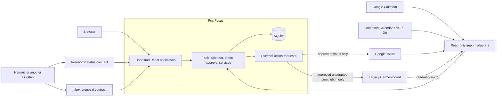
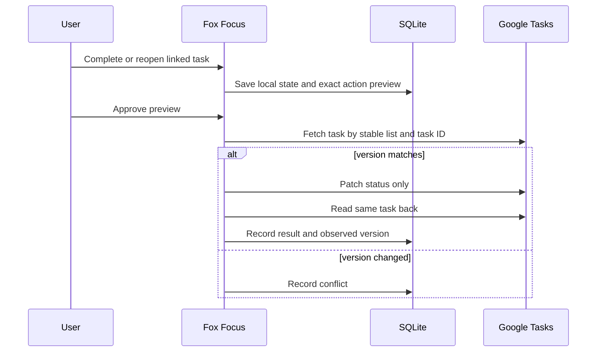

# Fox Focus architecture and delivery plan

Status: living implementation contract, updated 13 September 2026.

Fox Focus is a small private task and time manager. It owns native tasks, shows calendar context, and gives incoming work one review point. It is not a study system, a general project manager, or a universal synchronization service.

The current release is a React, Hono, and SQLite application with native tasks, PWA installation, Web Push and in-tab reminders, read-only Google and Microsoft imports, and a persistent Hermes task mirror. The Google bridge can complete or reopen an explicitly adopted task after an exact preview and approval. The separate legacy Hermes action client can complete only an unadopted mirrored task, and stays disabled until the matching plugin, private endpoint, token, and full completion effects have been reviewed. Gmail capture, MCP, durable background jobs, and broader provider writes are not implemented. Real-account Microsoft use still needs an Entra app registration.

The [task ownership and sync handover](task-organisation-and-sync-handover.md) records the approved product behaviour. This document describes the technical shape and safety boundaries.

## Product shape

The browser has four routes or route-like views:

- Today is a short daily home.
- Tasks contains the full searchable task browser and task detail.
- Calendar contains the day and upcoming schedule.
- Inbox contains captures and proposals that need a decision.

Only the active view renders its full working list. The page has one vertical scrollbar. A nested task scroller is a bug, not a compact layout.

Today should normally show:

1. The current calendar item, or the next one if nothing is active.
2. Around five active tasks selected by due date, planned time, and priority.
3. Due-soon deadlines that are not already clear in the task list.
4. The Inbox count and the next decision.

Task rows retain the useful density of the current browser. The checkbox completes or reopens. The rest of the row opens task detail. On small screens, keep the deadline visible and move secondary controls into the detail view.

## Ownership rules

Every record has one owner.

| Record | Owner | Fox Focus behaviour |
| --- | --- | --- |
| Native personal task | Fox Focus | Canonical task and completion history. |
| Explicitly adopted legacy Google task | Fox Focus | Canonical local task with an optional completion-only Google link. |
| Unadopted Google or Microsoft task | Provider | Read-only imported context. |
| Local calendar block | Fox Focus | Canonical local record. Any future provider representation needs its own approval. |
| Imported Google or Microsoft calendar event | Provider | Read-only context. |
| Gmail, Canvas, or other source material | Source provider | Evidence or an Inbox proposal, not an automatic task. |
| Unadopted personal task during Hermes migration | Hermes board | Read-only shadow used for reconciliation. |
| Personal task after its approved adoption | Fox Focus | Hermes may read status and submit Inbox proposals. |
| Hermes run or operational board | Hermes | Optional read-only context with a link back. |

The existing Hermes `personal-tasks` board remains canonical until explicit live migration approvals begin. Approving a Hermes adoption is the cutover for that one task. Hermes remains canonical for every task that has not been adopted until the final checked migration completes. Building and testing the migration code does not grant any live approval.

## System shape

One Node process serves the static client and API. One SQLite file stores the workspace, provider mirrors, adoption decisions, and action history. One user and one replica do not need PostgreSQL, Redis, a message broker, or several services.

Provider calls must not happen inside an open SQLite write transaction. A small durable job loop is appropriate when retries, scheduled imports, or notification delivery need to survive restarts.

## Native task model

The core model contains only fields Fox Focus understands and owns:

| Field | Meaning |
| --- | --- |
| `id` | Stable Fox Focus identity. |
| `title` | User-facing task text. |
| `area` | One shallow local category. |
| `state` and `completed` | Current workflow and completion state. |
| `deadlineDate` | Optional date-only deadline. |
| `scheduledDate` and `scheduledTime` | Optional local day and time chosen for doing the work. |
| `duration` | Human-readable duration estimate. |
| `priority` | Local ordering hint. |
| `createdAt` and `completedAt` | Native lifecycle timestamps. |

A new task needs no provider field. Local behavior must not branch on whether Google or Hermes is connected.

The workspace JSON holds native tasks while the app stays small. SQLite tables separately hold provider mirror records, opaque connection generations, adoption previews, idempotent action requests, and Hermes proposal keys.

## Optional external links

An external link records provenance and the only permitted provider action:

| Field | Meaning |
| --- | --- |
| Parent task | The link is embedded in one stable native task. |
| `provider` and `connectionId` | Source provider and opaque local connection generation. This is not a verified account name or email. |
| `containerId` and `externalId` | Stable remote list and task identity. |
| `sourceVersion` | Last observed concurrency token. |
| `sourceStatus` and `sourceUpdatedAt` | Last normalized remote state recorded on the link. |
| `policy` | `read_only` or `completion_only`. |
| `linkedAt` | When Fox Focus approved this link. Provider connection state separately records the last successful import. |

Removing this row must not damage the task. Provider-specific fields stay at this boundary instead of leaking into task creation and editing.

One native task can keep source links, but only one link may receive a write for a given user action. Fox Focus never fans a completion out to several task systems.

## Adoption model

Adoption is a one-time ownership change. The source import and the native task stay distinct until the user approves the preview.

The durable adoption record needs:

- provider, opaque connection generation, container, stable external ID, and source version;
- normalized source title, status, due value, and safe provenance;
- exact native task fields that will be created;
- approval state, creation time, and expiry;
- a request ID and the resulting native task ID.

Approval creates the task and link atomically. Matching the stable external identity prevents repeated approval or a later import from creating a second task.

An optional `targetTaskId` makes reconciliation explicit. It adds the imported provider link to an existing native task, including one adopted from Hermes, without replacing that task's title, area, priority, deadline, plan, or completion state. If the same provider IDs were linked through an older connection generation, Fox Focus refuses an automatic match. The user must select the existing task and approve the new preview.

Inbound refresh replaces the provider mirror. It does not overwrite the native task or automatically rewrite its embedded link. A missing or deleted remote record disappears from the mirror, which blocks a new status preview, but the native task and its last approved provenance remain. A successful approved status write updates the link's observed status and version.

## Google status write-through

The first outbound task integration supports only completion and reopening for adopted Google tasks whose link policy is `completion_only`.

An action request records:

- local task ID, opaque provider connection reference, list ID, and task ID;
- exact before and after status;
- expected ETag or version;
- requested operation, approval state, and expiry;
- idempotency key, attempt count, verified result, and error.

The approval view names the Fox Focus task, opaque connection reference, Google list, Google task title and ID, current and requested states, and expected ETag. The connection reference distinguishes authorization generations but does not claim to identify a Google account or email address.

The UI updates the native state even if Google is down. A retryable failure remains visible with Retry. A conflict or non-retryable failure offers a fresh preview of the current local state after any required refresh or reconnection. Retrying keeps the same logical idempotency key and performs a new read before deciding whether a patch is necessary.

If the fetched task already has the requested state, Fox Focus records success from the readback. If its version changed in another way, Fox Focus records a conflict and requires a new preview. It never silently overwrites the remote record.

The bridge cannot:

- create a Google task for a new native task;
- change title, notes, due date, order, parent, or list;
- delete a task;
- invoke the list-wide completed-task clear operation;
- write an assigned Docs or Chat task;
- copy the same change to Microsoft or Hermes.

Google refresh keeps provider records under their stable external identities. It cannot create another native task or move a locally completed task back to active.

## Legacy Hermes action bridge

The mounted Hermes board and completion plugin exist only for tasks that Hermes still owns during migration. Fox Focus polls the mounted board read-only and stores a normalized mirror plus Fox-owned planning annotations. It never writes the Hermes SQLite file.

An unadopted mirrored task may use `POST /api/v1/hermes/tasks/:taskId/complete` after the user confirms the exact completion preview. The client then calls the separately installed `fox-focus-sync` Hermes plugin with an optimistic version, idempotency key, approval ID, and a token limited to `kanban:personal-tasks:complete`. The plugin fixes the board to `personal-tasks` and returns a durable receipt for readback and reconciliation.

Fox Focus rejects this legacy completion route once the Hermes task has been adopted. The adopted native task is then local truth. After the final cutover, Hermes uses only the task-status and Inbox proposal routes.

## Time and date rules

- Store exact instants in UTC.
- Render user-facing times in `Europe/Dublin`.
- Store date-only values as `YYYY-MM-DD`, never midnight UTC.
- Keep a task deadline, planned task time, and calendar interval separate.
- Preserve all-day calendar ends as exclusive dates.
- Test Dublin spring-forward gaps and autumn-back ambiguities.

Google Tasks serializes its due value as a timestamp but only retains the date. Render it as `Do on`, not a timed deadline.

## Reminders and PWA boundary

The browser shell can install as a PWA. A user can opt one browser into Web Push, and Fox Focus stores its subscription and a per-reminder delivery record in SQLite. The Node process checks due reminders every minute, sends each scheduled reminder once per subscription and fire time, removes expired subscriptions, and includes reminders up to 24 hours late after a restart. This is best-effort delivery, not a durable general job queue.

In-tab reminders still fire while the page is open when push is unsupported or disabled. A snooze creates a new fire time and therefore a new delivery key. iPhone and iPad users must install the app on the Home Screen before the browser offers Web Push permission.

## Inbox and agent boundary

Inbox is the write boundary for assistants. `POST /api/v1/task-proposals` accepts a title, summary, optional area, and idempotency key. Fox Focus records the actor and source as Hermes. A user can accept the item as a task, schedule a local calendar block, request more work, defer it, or dismiss it.

No assistant receives a tool that completes, reopens, edits, or deletes a task. No assistant receives a provider token or an action-approval capability.

Hermes reads the safe projection at `GET /api/v1/task-status`. It returns the workspace revision, generation time, open, completed, scheduled, and waiting counts, plus normalized task status. The projection excludes task notes, private source bodies, raw provider payloads, filesystem paths, sessions, credentials, and approval details. An ETag allows a polling client to receive `304 Not Modified`.

Set `HERMES_STATUS_TOKEN_FILE` to an owner-controlled file containing a token of at least 24 characters. The server loads it at startup and accepts it as a bearer token only for task status and proposals. The owner can use Basic authentication on every private API route.

## Private API contract

REST is the implemented private contract. An MCP adapter may call the same domain services later.

| Route | Purpose |
| --- | --- |
| `GET /api/v1/workspace` and `PUT /api/v1/workspace` | Read and revision-save the owner's native workspace. |
| `GET /api/v1/hermes` and `POST /api/v1/hermes/sync` | Read or refresh the transitional Hermes mirror. |
| `PUT /api/v1/hermes/tasks/:taskId/annotation` | Save Fox-owned planning details against a mirrored task. |
| `POST /api/v1/hermes/tasks/:taskId/complete` | Submit one confirmed legacy completion for an unadopted Hermes task when the separate bridge is configured. |
| `GET /api/v1/integrations` and provider connect, callback, and sync routes | Show safe connection state, complete OAuth, and refresh imported context. |
| `GET /api/v1/task-status` | Return the safe read-only Hermes projection with ETag support. |
| `POST /api/v1/task-proposals` | Add one idempotent Hermes proposal to Inbox. |
| `POST /api/v1/task-adoptions/preview` | Preview adoption of one imported Google, Microsoft, or Hermes task. |
| `POST /api/v1/task-adoptions/:id/approve` | Approve an unexpired adoption preview. |
| `GET /api/v1/task-actions` | List external status actions, optionally filtered by task ID. |
| `POST /api/v1/task-actions/preview` | Save an idempotent completion or reopen preview for an adopted Google task. |
| `POST /api/v1/task-actions/:id/approve` | Apply the local state and execute the approved Google status request. |
| `POST /api/v1/task-actions/:id/retry` | Retry an eligible failed action after another guarded read. |

The Hermes bearer token works only on `GET /api/v1/task-status` and `POST /api/v1/task-proposals`. All other routes require owner Basic authentication. Mutation routes reject cross-origin browser requests and limit request bodies.

Fox Focus publishes no API catalog, OpenAPI document, MCP endpoint, or `llms.txt`. This is a private API with two explicitly configured Hermes operations.

## Provider boundaries

### Google Calendar

Import selected calendars as read-only context. A future writable Fox Focus calendar is a separate project and must use exact previews, ETag checks, readback, and clear guest-notification behavior.

### Google Tasks

The Google connection requests `https://www.googleapis.com/auth/tasks`, while both Calendar scopes remain read-only. Existing connections granted only `tasks.readonly` must reconnect. Server policy still limits writes to status changes on explicitly adopted tasks. Assigned Docs and Chat tasks import with a read-only policy. Polling and periodic full reconciliation remain necessary because Google Tasks has no documented sync token or push channel. If authorization changes while an older import is running, Fox Focus discards that old generation's result instead of labeling it with the new connection.

### Microsoft

Microsoft Calendar and To Do remain read-only imports. Do not build a second task-home bridge while the narrow Google legacy bridge is being proved.

### Gmail and Canvas

Keep them authoritative. Import only the normalized fields needed for a due-soon signal or Inbox proposal. Do not store raw bodies by default and do not let source text authorize an action.

### Hermes

Use the mounted read-only SQLite adapter only during migration. Before adoption, the separately configured legacy action bridge may complete one Hermes-owned task after explicit confirmation. After adoption, that route is blocked for the task. Hermes can call `GET /api/v1/task-status` and `POST /api/v1/task-proposals` with the token loaded from `HERMES_STATUS_TOKEN_FILE`. Fox Focus never writes the Hermes database.

## Rollout and cutover

### Implemented local foundation

- Today, Tasks, Calendar, and Inbox are separate views.
- The task browser uses the page scrollbar and keeps deadlines visible on phone-sized layouts.
- Native task state, completion history, optional links, adoption previews, and external action records persist locally.
- The Hermes status and proposal routes enforce the narrow bearer-token boundary.
- Web Push subscriptions and deduplicated deliveries persist locally, with an in-tab fallback.
- The old Hermes board can remain mounted as a read-only mirror. Its separate action bridge applies only to unadopted tasks and is off unless an operator configures every required part.

Fox Focus remains useful with every integration disabled.

### Next operator step: shadow and adoption

- Import Google and Hermes tasks without changing the source.
- Reconcile stable IDs, duplicates, status, and date-only values. Use the explicit existing-task target when one provider record belongs to a Hermes-adopted task.
- Preview adoption against fixtures, then selected read-only live records.
- Verify idempotent approval and no resurrection after refresh.

Exit check: a source task can become one native task without a provider write.

### Later operator step: Hermes cutover

- Back up and validate the current board.
- Briefly freeze task changes.
- Run a final reconciliation and show the exact cutover set.
- Request explicit approval, then make Fox Focus canonical.
- Change Hermes to status reads and Inbox proposals.

Exit check: every migrated task has one owner and the old board is recoverable.

### Live Google enablement

- Reconnect Google through the current full Tasks consent flow if the stored grant is read-only.
- Enable `completion_only` on selected adopted links.
- Test success, existing desired state, revoked access, transient failure, retry, stale ETag, missing source records, assigned tasks, and readback.

Exit check: one approved status change reaches the same Google task once, while a failure never loses local completion.

### Reliability work

- Back up SQLite through its online backup API or `VACUUM INTO` and validate with `PRAGMA quick_check`.
- Add visible freshness, action failure, and conflict states.
- Add a token-rotation runbook and distinct credentials if another agent client is added.
- Run an isolated restore drill.

## Acceptance checks

| Area | Check |
| --- | --- |
| UI | Four real views, one page scrollbar, row opens detail, checkbox changes completion, deadline remains visible on phone. |
| Native tasks | New tasks work offline from providers and never trigger an external create. |
| Adoption | Duplicate preview or approval creates one local task and one external link. |
| Completion | Local state survives provider failure and completed history stays visible. |
| Google write | Only status changes, exact preview and approval exist, ETag is checked, and the same task is read back. |
| Conflict | A stale remote version blocks the patch and creates a visible conflict. |
| Refresh | An adopted task is never duplicated or resurrected. A missing provider record blocks a new write preview and never deletes local history. An old connection generation cannot publish a late import. |
| Hermes | Hermes reads only safe task status, proposals enter Inbox, and Hermes cannot mutate Fox tasks or read provider secrets. |
| Time | Dublin DST boundaries and date-only Google values round-trip correctly. |
| Storage | WAL is active, migrations apply to a clean database, and an isolated backup passes `quick_check`. |

## Source material

- [Google Tasks resource](https://developers.google.com/workspace/tasks/reference/rest/v1/tasks), [patch](https://developers.google.com/workspace/tasks/reference/rest/v1/tasks/patch), and [OAuth scopes](https://developers.google.com/workspace/tasks/auth)
- [Google Tasks clear](https://developers.google.com/workspace/tasks/reference/rest/v1/tasklists/clear) and [assigned task restrictions](https://developers.google.com/workspace/tasks/reference/rest/v1/tasks/delete)
- [Google Calendar incremental sync](https://developers.google.com/workspace/calendar/api/guides/sync) and [resource versions](https://developers.google.com/workspace/calendar/api/guides/version-resources)
- [SQLite write-ahead logging](https://www.sqlite.org/wal.html), [online backup](https://www.sqlite.org/backup.html), and [`VACUUM INTO`](https://sqlite.org/lang_vacuum.html)
